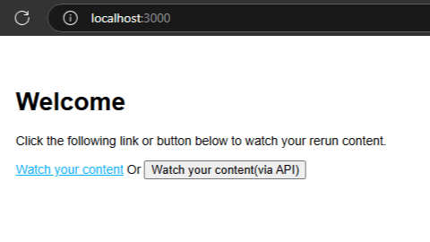

# ตัวอย่างการสร้าง Magic Redeem Link บน Playboard สำหรับใช้กับเว็บแอปพลิเคชันของท่าน

คุณสามารถพาผู้ใช้จากเว็บไซต์ของคุณ มารับชมคอนเทนต์บน Playboard ได้ง่ายๆ และไม่ต้องกังวลเรื่องการเช็คสิทธิ์การดูระหว่าง service ให้ยุ่งยาก
เพียงใช้งาน Magic Redeem Link โดยทำตามตัวอย่างในโปรเจกต์ตัวอย่างนี้ได้เลย

สำหรับโปรเจกต์ตัวอย่างนี้ พัฒนาด้วยภาษา JavaScript และใช้ Express เป็น Web Server

## วิธีการติดตั้ง

1. Clone repository นี้
2. รันคำสั่งเพื่อติดตั้ง dependencies

```bash
npm install
```

## วิธีการรัน

รันคำสั่งต่อไปนี้ จากนั้นเข้าทดสอบการใช้งานที่ [http://localhost:3000](http://localhost:3000)

```bash
npm run start
```

## ฟีเจอร์เบื้องต้น

เว็บไซต์ตัวอย่าง มีเพียงหน้าเดียวดังภาพด้านล่าง



เมื่อผู้ใช้คลิกที่ลิงก์ หรือกดปุ่ม จะถูก redirect ไปที่หน้า `https://www.playboard.cloud/magic-redeem` พร้อมกับส่ง token ผ่านคิวรีสตริง
เพื่อให้ผู้ใช้ได้รับชมคอนเทนต์นั้นๆ โดยที่ token ดังกล่าวจะถูกสร้างให้ถูกต้องได้จากทาง 3rd-party platform เท่านั้น
ทาง Playboard สามารถตรวจสอบความถูกต้องได้เท่านั้น ไม่สามารถสร้างขึ้นเองได้

ทั้งนี้สำหรับการนำไปแสดงผลบนเว็บไซต์ของท่าน ทำได้ 2 ทาง

### รูปแบบที่ 1: ทำเป็นลิงก์ให้ผู้ใช้กดแล้วรับชมได้ทันที

วิธีนี้ ผู้ใช้จะเรียกหน้าพิเศษ บนเว็บไซต์ของท่าน (ซึ่งหน้านี้จะต้องทำงานบน Server side) จากนั้นฝั่งเซิฟเวอร์จะสร้าง Magic redeem link
ระบุข้อมูลผู้ใช้และคอนเทนต์ที่จะได้ดู สำหรับผู้ใช้ท่านนั้น แล้ว Redirect user ไปที่ลิงก์ดังกล่าวทันที โดยการ response ด้วย HTTP status code 307

### รูปแบบที่ 2: ทำเป็นปุ่มขอลิงก์ผ่าน API

วิธีนี้ ผู้ใช้จะกดปุ่ม เพื่อเรียก HTTP API (โดยส่วน UI อยู่บน Frontend) จากนั้นฝั API จะสร้าง Magic redeem link ระบุข้อมูลผู้ใช้และคอนเทนต์ที่จะได้ดู
สำหรับผู้ใช้ท่านนั้น แล้ว Response URL กลับมาที่ Frontend เพื่อให้ Frontend จัดการต่อไป

## การนำโค้ดไปแก้ไขและใช้งานจริง

โค้ดในส่วนที่เกี่ยวข้องจะประกอบไปด้วย:

- [`routes/lib/playboard-integration.js`](https://github.com/playboard-cloud/example-magic-redeem-link-express/blob/main/routes/lib/playboard-integration.js) สามารถคัดลอกไปใช้ได้เลย
- [`routes/index.js`](https://github.com/playboard-cloud/example-magic-redeem-link-express/blob/main/routes/index.js) จะมี route ที่เกี่ยวข้องที่ให้เลือกเอาไปใช้ อย่างใดอย่างหนึ่ง (และต้องแก้ไขข้อมูลตามการใช้งานจริง) คือ
    - `/events/:eventId/watch` สำหรับลิงก์เข้าชม ที่ผู้ใช้กดได้โดยตรงด้วยแท็ก `<a>` เมื่อเข้าแล้วผู้ใช้จะถูก redirect ไปตาม Magic redeem link ที่ถูกสร้างขึ้น (ตามรูปแบบที่ 2)
    - `/api/events/:eventId/actions/create-watch-link` เป็น API สำหรับสร้าง Magic redeem link และส่งให้กับ Frontend ทาง API จากนั้นให้ทาง Frontend ทำการ Redirect เอง (ตามรูปแบบที่ 2)

เมื่อนำโค้ดทั้งสองส่วนไปประกอบในแอปพลิเคชันของท่านแล้ว พิจารณาแก้ไข Option ตามด้านล่าง

## Option ที่ใช้ในการสร้าง Magic redeem link

ใน API ทั้งสองตัว จะมีการเรียกใช้ฟังก์ชัน `ensureUserAuthorizedAndMakeMagicRedeemLinkParams` เพื่อตรวจสอบการซื้อ และต้อง return object
ที่เป็นพารามิเตอร์สำหรับสร้าง Magic redeem link ดังต่อไปนี้ (ซึ่งต้องแก้ไขให้เข้ากับแอปพลิเคชันของท่าน)

- `userRefCode` ระบุ User ID ของผู้ใช้ ใน service ของท่านเอง ที่จะได้รับชม
- `userDisplayName` ระบุ Display Name ของผู้ใช้ ใน service ของท่านเอง ที่จะได้รับชม
- `redeemCode` ระบุ Redeem Code สำหรับระบุคอนเทนต์ที่ผู้ใช้จะได้รับชม โดยท่านอาจใช้ Event ID, Ticket ID หรือ ID ที่อ้างอิงต่อสิ่งที่ผู้ใช้ได้ซื้อไว้ และกรอก ID เดียวกันนี้ที่หน้าตั้งค่าคลาสบน Playboard ให้ตรงกัน

## Option กลางเกี่ยวกับการสร้าง Magic redeem link

นอกเหนือจาก Option ข้างต้น จะมีออปชันบางส่วนภายในไฟล์ `routes/lib/playboard-integration.js` ที่ท่านต้องแก้ไข ดังต่อไปนี้

- `magicRedeemLinkPrivateKeyPath` ระบุพาธของไฟล์ Private key แบบ ECDSA 256 bit สำหรับสร้าง Magic redeem link
- `magicRedeemLinkBaseUrl` ระบุ URL ส่วนต้นของ Magic Redeem Link ที่ได้จากทาง Playboard

## การสร้าง Private key สำหรับสร้าง Magic redeem link

ใน repository นี้มีตัวอย่าง key อยู่ที่โฟลเดอร์ `./resources` **ห้ามใช้ key นี้บนระบบ production** แต่ให้ท่านสร้างใหม่
[โดยดูวิธีการที่นี่](https://notes.salrahman.com/generate-es256-es384-es512-private-keys/)

เมื่อสร้างแล้ว ให้ส่งเฉพาะ Public key ให้กับทางทีมงาน Playboard เพื่อใช้ในการเชื่อมต่อกัน สำหรับ Private key ให้นำไปใช้

## Production checklist

- สร้าง key ใหม่สำหรับสร้าง Magic redeem link
- แก้ไข option ต่างๆ ครบถ้วน โดยค้นหาคอมเมนต์คำว่า TODO: และแก้ไข Option ต่างๆ ทุกจุดที่ปรากฎ
